> [!IMPORTANT]
>
> This is a step-by-step guide for running this project. Follow each step as outlined here.


## 1.Prerequisites and dataset 

> [!NOTE]
>
> The project root directory refers to: <u>*C:\Users\XXX\Desktop\realtime_fraud_detection*</u> or similar to this

##### Device requiement

- **CPU**: 4+ cores recommended
- **Memory**: 8GB minimum, 16GB recommended
- **OS**: Linux, macOS, or Windows with WSL2

##### Clone or download project:

```
git clone https://github.com/guoxinpony/realtime_fraud_detection.git
```

​     **OR**

Download ZIP:

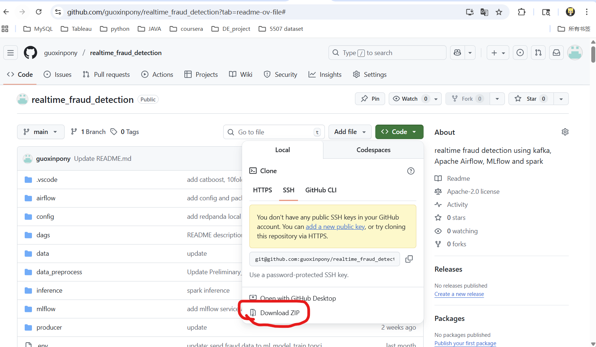


##### Install Docker Desktop:

1. download package from: https://www.docker.com/products/docker-desktop/
2. Install docker desktop. If you are using Windows system, the installation process will prompt you to enable WSL2. Follow the instructions to enable WSL2 and restart your computer.
3. Launch Docker Desktop

##### Download Dataset:

1. Download from: https://drive.google.com/file/d/1y1QqL1BdJKMpEu4dOB5OKANPeUxIkl3X/view?usp=drive_link, and place the dataset in the data directory within the project.

​    OR

2. Download from Kaggle: https://www.kaggle.com/datasets/kartik2112/fraud-detection, including two datasets: fraudTest.csv and fraudTrain.csv; and place the two datasets in the data directory within the project; and RUN in location of project root directory:

   ```python
   python ./data_preprocess/merge_data.py
   ```

##### Configure Environment Variables (.env file):

Make sure`.env` file in the project root directory with the following content:

```bash
# MinIO Configuration
AWS_ACCESS_KEY_ID=minio
AWS_SECRET_ACCESS_KEY=minio123
MINIO_USERNAME=minio
MINIO_PASSWORD=minio123

# Airflow UID
AIRFLOW_UID=50000

# kafka/Redpanda
KAFKA_BOOTSTRAP_SERVERS=kafka_broker:9092
KAFKA_TOPIC=ml_model_train
```

> [!NOTE]
>
> The `.env` file is required for the system to connect to MinIO (object storage) and MLflow. The default values shown above match the MinIO login credentials used in step (5) of section 3. If you change the MinIO username or password, make sure to update both the `.env` file and the MinIO login credentials accordingly.

##### MAC OS/ Linux required: Change permission of Script in location of project root directory:

```shell
chmod +x wait-for-it.sh
```


## 2.Docker image build

The initial build takes some time, which includes downloading the official image, necessary packages, and the build process itself. The exact duration depends on your computer's performance and network connection.

In the project root directory, build the following four images airflow-webserver, mlflow-server, producer, and inference. Input in the terminal: 

```shell
docker compose build airflow-webserver
```

```
docker compose build mlflow-server
```

```
docker compose build producer
```

```
docker compose build inference
```


## 3.Start Services and Check

##### (1)Use the following command to start all services(containers), and waiting for all container run successfully:

```
docker compose up -d
```


##### (2) Open http://localhost:8080/home in your browser, then enter the username admin and password admin; If the page fails to open, it indicates that the service has failed to run:

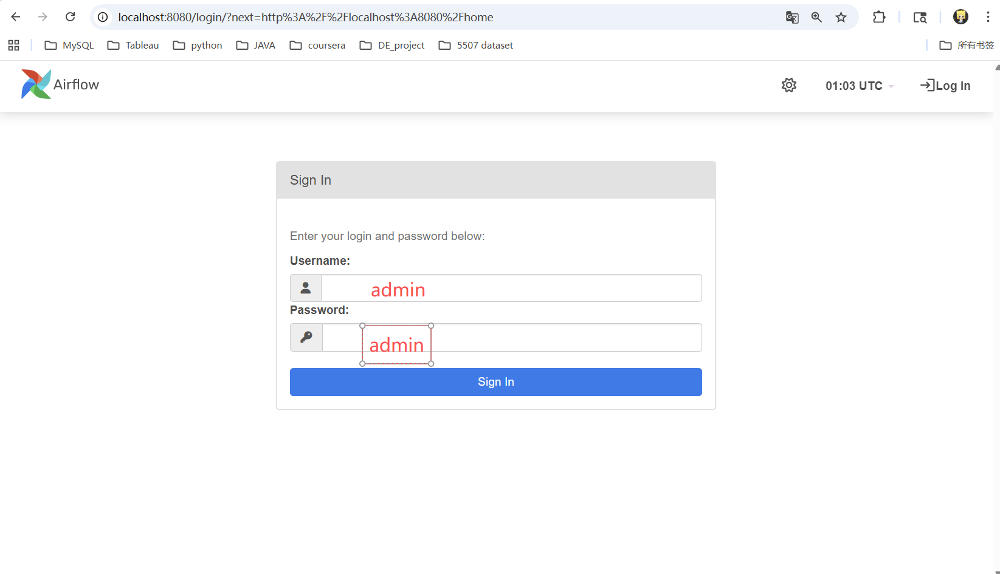

You should be able to see:

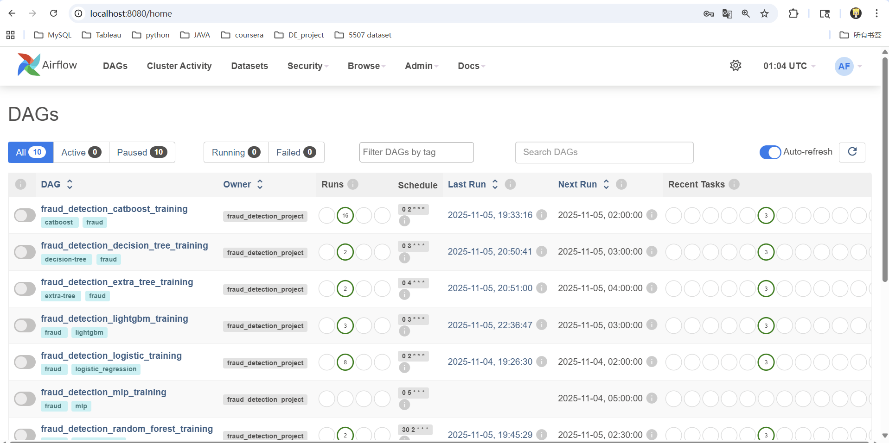


##### (3) Open http://localhost:5500/ in your browser, If this is the first time opening it, this interface should be blank, and the `fraud_detection` directory does not exist:  

> [!NOTE]
>
> After running a task that trains a model in Airflow, a fraud_detection directory will appear.

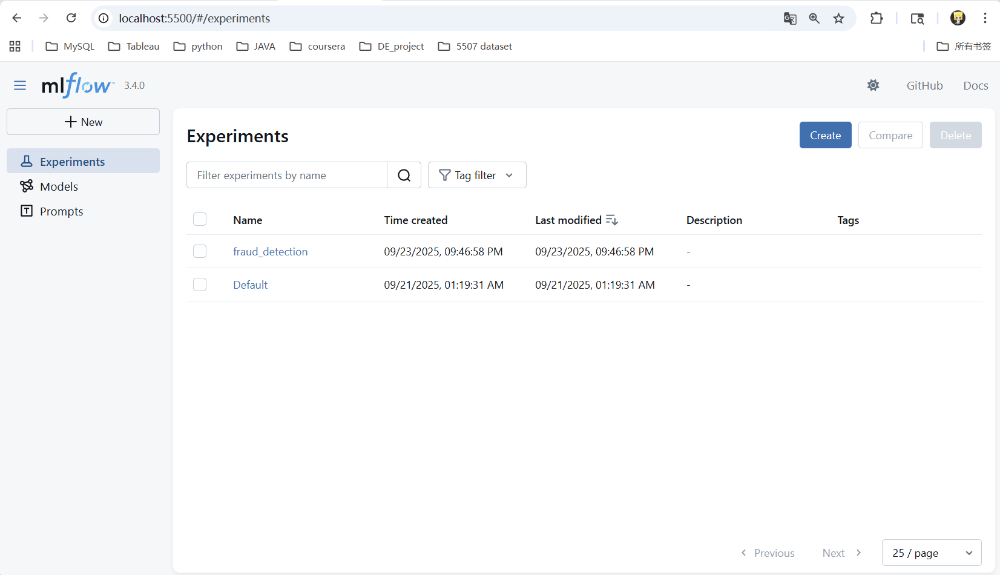


##### (4) Open http://localhost:8090/overview in your browser, you may notice the growing volume of data.


##### (5) Open http://localhost:5555/ in your browser, You should be able to see two workers online.

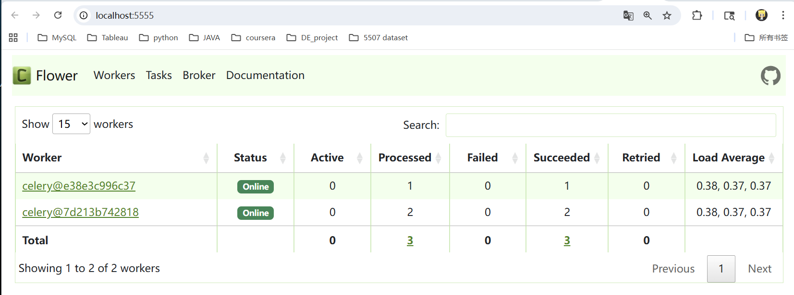


##### (6) Open http://localhost:9001/ in your browser, Username is minio, password is minio123: 

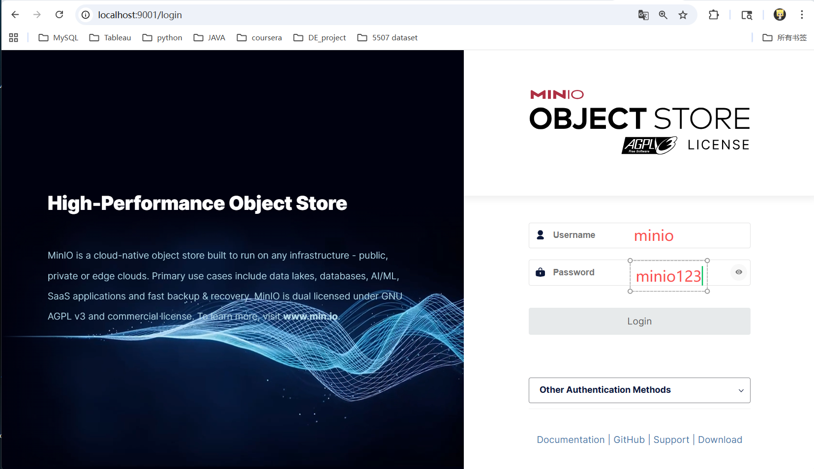


After logging in, you will see:

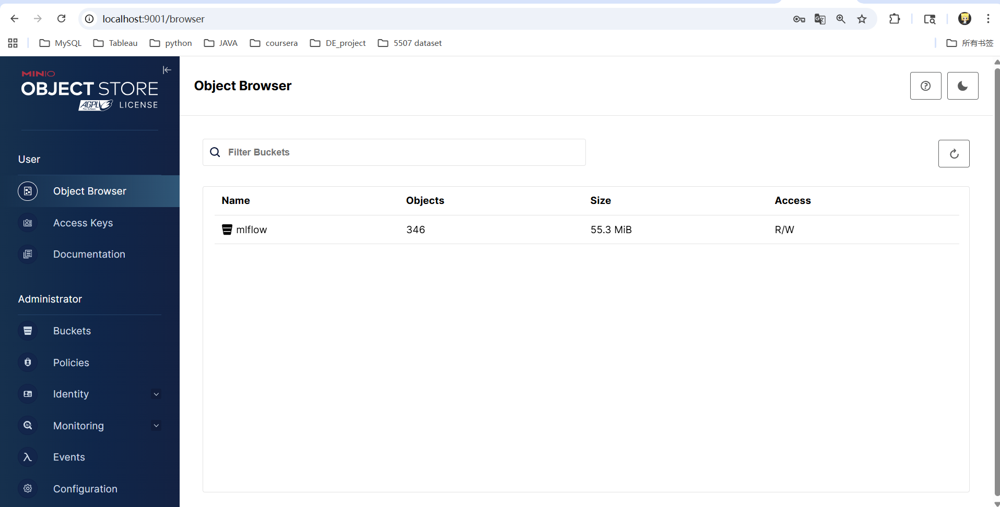


##### (7) In Docker Desktop, Open the container named `mc`. 

> [!NOTE]
>
> If you see the prompt *“Added `minio` successfully,”* it indicates you have successfully created a storage bucket named `mlflow` in Minio.

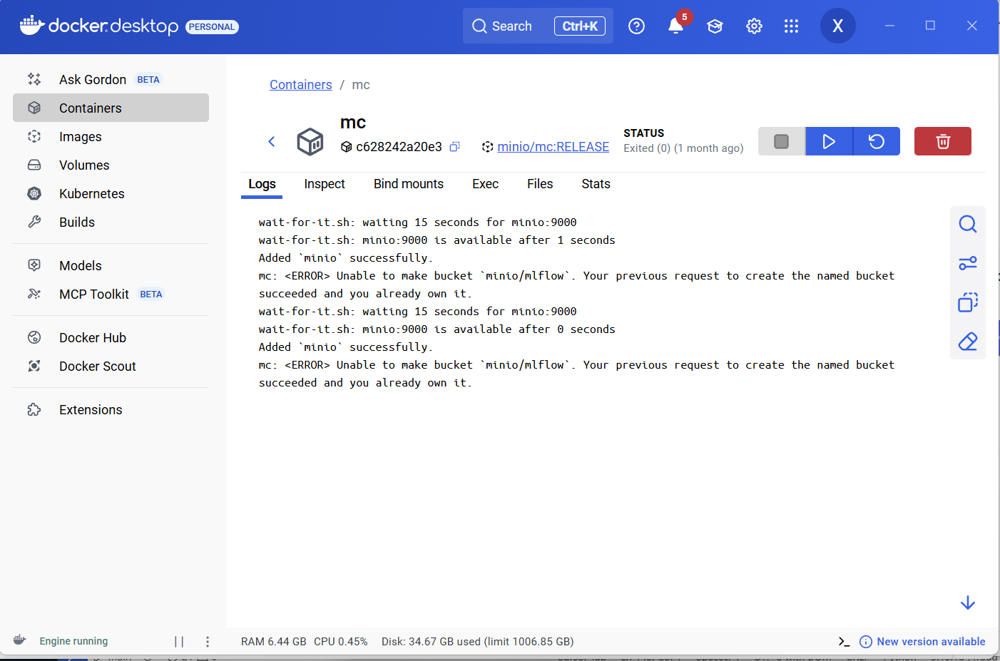


## 4.Model Training and Viewing Inference Results

##### (1) Access Airflow Web UI:

1. Open http://localhost:8080/home in your browser
2. Log in with username `admin` and password `admin`


##### (2) Find and Enable DAGs:

In the Airflow home page, you will see a list of DAGs (Directed Acyclic Graphs) for different model training tasks

1. Each DAG corresponds to a different machine learning model:
   - `fraud_detection_xgboost_training` - XGBoost model
   - `fraud_detection_lightgbm_training` - LightGBM model
   - `fraud_detection_logistic_training` - Logistic Regression model
   - `fraud_detection_catboost_training` - CatBoost model
   - `fraud_detection_mlp_training` - MLP (Neural Network) model
   - `fraud_detection_random_forest_training` - Random Forest model
   - `fraud_detection_decision_tree_training` - Decision Tree model
   - `fraud_detection_extra_tree_training` - Extra Trees model
   - `fraud_detection_tabnet_training` - TabNet model

3. By default, DAGs are paused. To enable a DAG:
   - Click the toggle switch on the left side of the DAG name to turn it ON (Blue)
   - The DAG will now be scheduled to run automatically according to its schedule

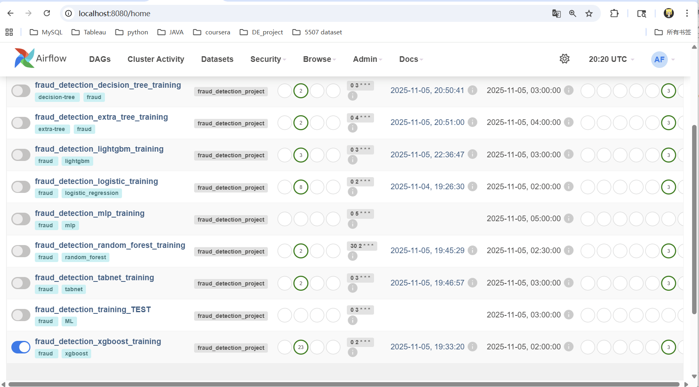


##### (3) Trigger Model Training:

###### **Option A: Manual Trigger (Recommended for first-time users)**

1. Click on the DAG name you want to run (e.g., `fraud_detection_xgboost_training`)
2. Click the "Play" button (▶) in the top right corner
3. Select "Trigger DAG" from the dropdown menu
4. The DAG run will start immediately

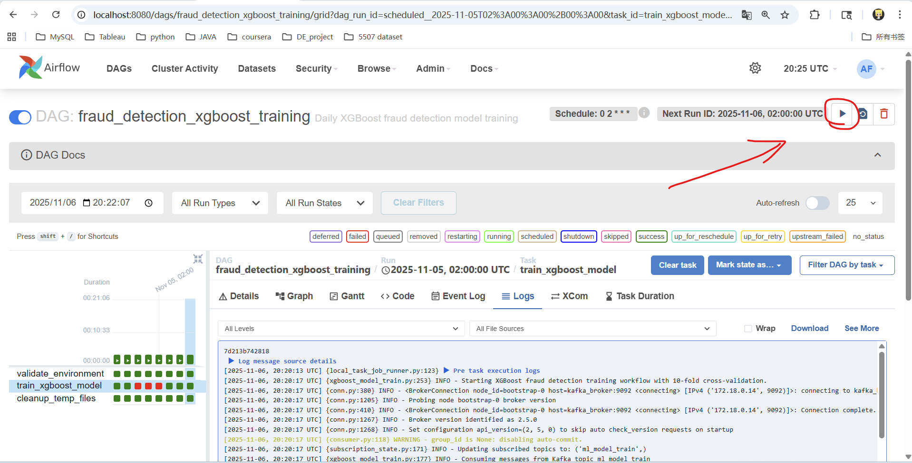

###### **Option B: Automatic Schedule**

- If you enabled the DAG and it has a schedule, it will run automatically at the scheduled time
- You can check the schedule by clicking on the DAG and viewing its details


##### (4) Monitor Training Progress:

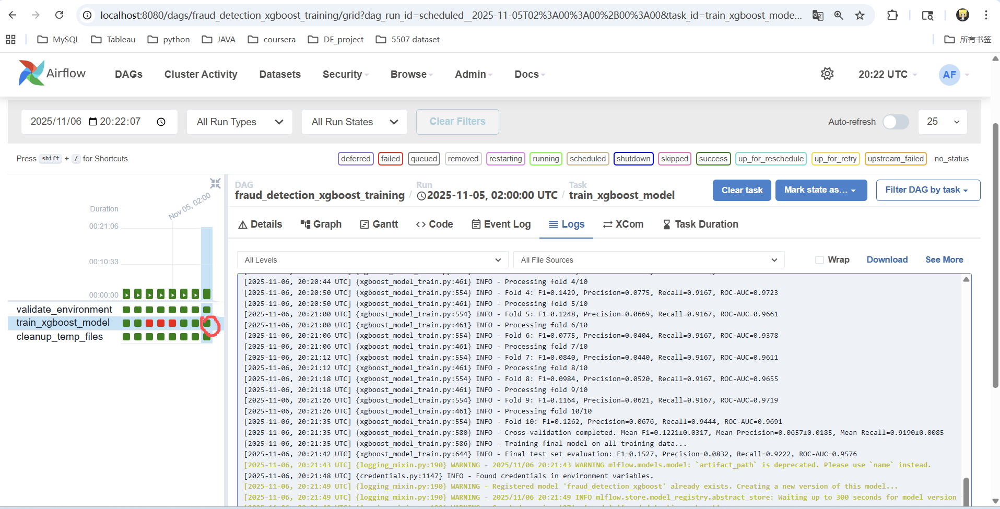

1. After triggering a DAG, you will see the DAG run appear in the "DAG Runs" view
2. Click on the DAG run to see the task execution graph
3. Each task will show its status:
   - **Queued** (gray) - Task is waiting to be executed
   - **Running** (light blue) - Task is currently executing
   - **Success** (green) - Task completed successfully
   - **Failed** (red) - Task encountered an error

4. Click on a task to view its logs and details


##### (5) Training Time and Resources:

> [!NOTE]
>
> - Model training typically takes 5-30 minutes depending on:
>   - The model type (XGBoost and LightGBM are faster, neural networks take longer)
>   - The amount of training data
>   - Your computer's CPU and memory
> - Training uses data from the `ml_model_train` Kafka topic or falls back to the CSV file specified in `config.yaml`
> - Trained models are saved to `/app/models/` directory and registered in MLflow


##### (6) Verify Model Training Success:

1. Check MLflow UI: http://localhost:5500/
   - After successful training, you should see:
     - A new experiment run in the `fraud_detection` experiment
     - Model metrics (precision, recall, F1-score, ROC-AUC, etc.)
     - The trained model artifact

2. Check model files:
   - In Docker Desktop, verify that model files are created in the `models` directory
   - Model files are named like: `fraud_detection_model_xgboost.pkl`, `fraud_detection_model_lightgbm.pkl`, etc.

3. Check Airflow task logs:
   - If a task fails, click on it to view error logs
   - Common issues: insufficient memory, missing data, or configuration errors


##### (7) Model Selection for Inference:

> [!NOTE]
>
> The inference service uses the model specified in `config.yaml` under `models.xgboost.path` (default: `/app/models/fraud_detection_model_xgboost.pkl`). To use a different model:
> 1. Train the desired model first
> 2. Update `config.yaml` to point to the correct model file
> 3. Restart the inference container: `docker compose restart inference`


##### (8) In Docker Desktop, click the Containers panel on the left and navigate to the inference container:

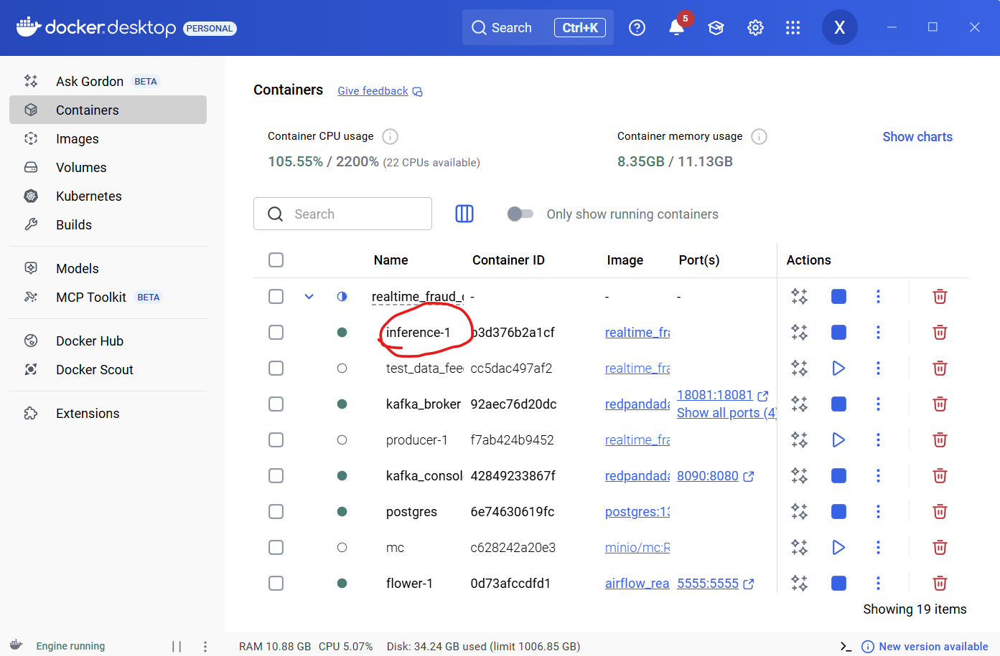


> [!NOTE]
>
> If you see information similar to the image below, don't worry—this indicates Spark is functioning normally and processing incoming credit card data.

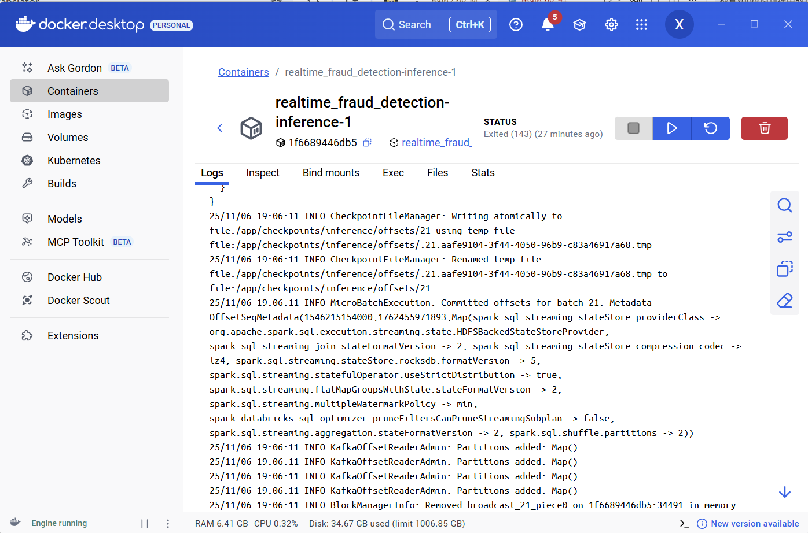


> [!NOTE]
>
> Under the logs bar, if you see the log entry `“INFO MicroBatchExecution: Streaming query has been idle and waiting for new data more than 10000 ms,”` it indicates that the system's inference component is ready and waiting for new credit card data to be pushed, utilizing the machine learning model to make inferences!
>
> To enable inference, simply start the `test_data_feeder` container, as Spark continuously monitors the `*fraud_test_data*` topic under Redpanda for incoming data.

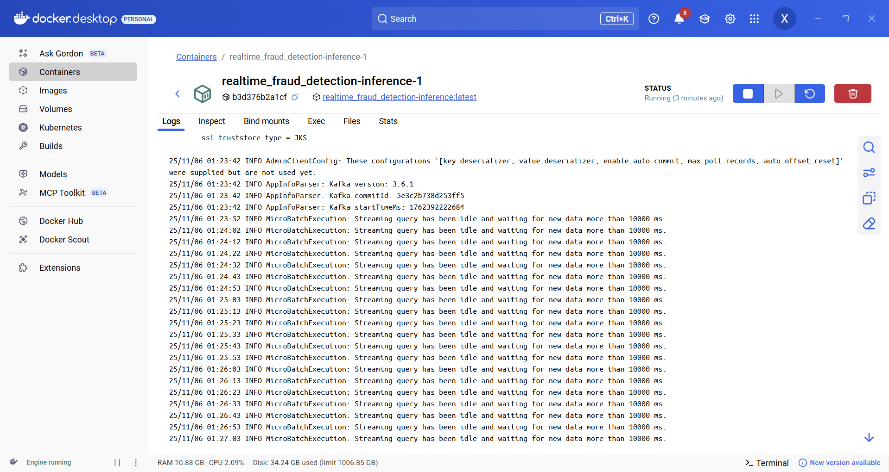


##### (9) You have just started the `test_data_feeder` container. This container simulates banks and financial institutions sending data to this system.

> [!NOTE]
>
> If you stop the container as shown in the figure, the logs will display: `INFO - main2 - Shutting down dataset producer` and `INFO - main2 - Dataset streaming completed. Messages sent: 39`

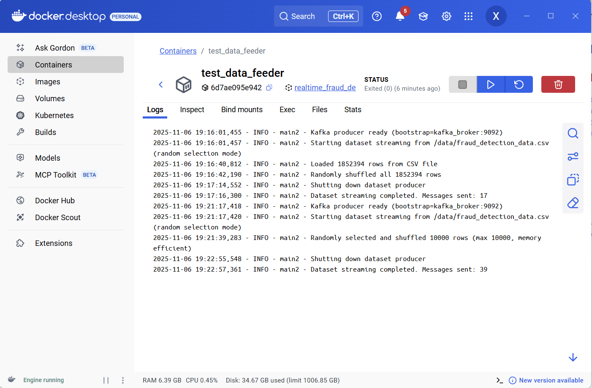


##### (10) Return to Redpanda: http://localhost:8090/topics

You'll find there are now three topics: ml_model_train, fraud_test_data, and fraud_predictions:

- **ml_model_train**: Store data sent by banks or financial institutions for model training
- **fraud_test_data**: Banks or financial institutions send data requiring inference to the fraud detection system
- **fraud_predictions**: Inference results from Spark; banks or financial institutions can read the results from this topic


##### (11) View Inference Results:

After starting the `test_data_feeder` container and data flows through the system, you can view the fraud detection predictions in several ways:

**Method 1: View Predictions in Redpanda Console (Recommended)**

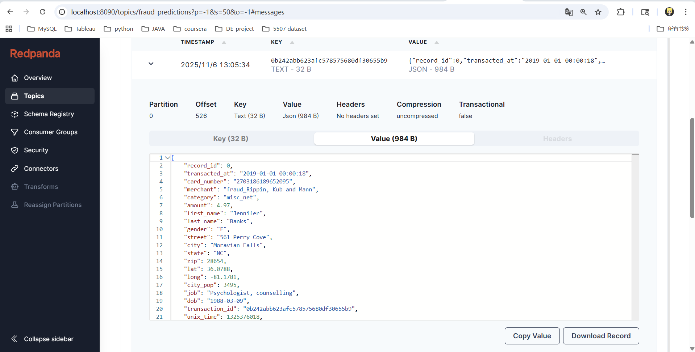

1. Open Redpanda Console: http://localhost:8090/topics
2. Click on the `fraud_predictions` topic
3. Click on the "Messages" tab
4. You will see real-time prediction results with the following information:
   - Transaction details (transaction_id, amount, merchant, etc.)
   - Fraud probability (0.0 to 1.0)
   - Prediction (0 = legitimate, 1 = fraud)
   - Timestamp of the prediction

> [!NOTE]
>
> The `fraud_predictions` topic contains the output from the inference pipeline. Each message represents a fraud detection prediction for a transaction.

**Method 2: View Inference Logs in Docker Desktop**

1. Open Docker Desktop
2. Navigate to the `inference` container
3. View the logs to see:
   - Processing status of each transaction
   - Any errors or warnings
   - Throughput information

```bash
# View recent predictions
docker exec -it kafka_broker rpk topic consume fraud_predictions --num 10
```

**Understanding Prediction Results:**

- **fraud_probability**: A value between 0.0 and 1.0 indicating the model's confidence that the transaction is fraudulent
  - Values closer to 1.0 indicate higher fraud likelihood
  - Values closer to 0.0 indicate legitimate transactions
  
- **prediction**: Binary classification result
  - `0` = Transaction is predicted to be legitimate
  - `1` = Transaction is predicted to be fraudulent
  
- **decision_threshold**: The probability threshold used for classification (configurable in `config.yaml`)

**Verifying System is Working:**

1. Start the `test_data_feeder` container (if not already running)
2. Wait a few seconds for data to flow through the system
3. Check Redpanda Console - you should see:
   - Messages appearing in `fraud_test_data` topic (input)
   - Messages appearing in `fraud_predictions` topic (output)
4. Verify predictions contain reasonable values:
   - Fraud probabilities should be between 0.0 and 1.0
   - Predictions should be either 0 or 1
   - Transaction IDs should match between input and output

**Troubleshooting:**

- If no predictions appear in `fraud_predictions`:
  - Check that `test_data_feeder` is running and sending data
  - Check inference container logs for errors
  - Verify the model file exists in `/app/models/` directory
  - Ensure the model path in `config.yaml` is correct

- If predictions seem incorrect:
  - Verify the model was trained successfully
  - Check that the model version matches the inference code
  - Review model metrics in MLflow to ensure good performance


## 5. Model Selection and Switching

**Understanding Model Configuration:**

The inference service uses the model specified in `config.yaml`. By default, it's configured to use the XGBoost model:

```yaml
models:
  xgboost:
    path: "/app/models/fraud_detection_model_xgboost.pkl"
```

**Available Models:**

After training, the following model files are available in the `models` directory:

- `fraud_detection_model_xgboost.pkl` - XGBoost (default)
- `fraud_detection_model_lightgbm.pkl` - LightGBM
- `fraud_detection_model_logistic.pkl` - Logistic Regression
- `fraud_detection_model_catboost.pkl` - CatBoost
- `fraud_detection_model_mlp.pkl` - MLP (Neural Network)
- `fraud_detection_model_random_forest.pkl` - Random Forest
- `fraud_detection_model_decision_tree.pkl` - Decision Tree
- `fraud_detection_model_extra_tree.pkl` - Extra Trees
- `fraud_detection_model_tabnet.pkl` - TabNet

**How to Switch Models:**

**Step 1: Train the Desired Model**

1. Follow the model training steps in section 4
2. Ensure the model training completes successfully
3. Verify the model file exists in the `models` directory

**Step 2: Update config.yaml**

1. Open `config.yaml` in the project root directory
2. Locate the `models` section
3. Update the model path. For example, to switch to LightGBM:

```yaml
models:
  xgboost:  # Note: The key name stays 'xgboost' but path changes
    path: "/app/models/fraud_detection_model_lightgbm.pkl"
```

Or if you want to use a different model section (if available in config.yaml):

```yaml
models:
  lightgbm:
    path: "/app/models/fraud_detection_model_lightgbm.pkl"
```

> [!NOTE]
>
> The inference service reads from `models.xgboost.path` by default. If your config.yaml has different model sections, you may need to update the inference code or ensure the path points to the correct model.

**Step 3: Restart Inference Service**

After updating the configuration:

```bash
# Restart the inference container to load the new model
docker compose restart inference
```

**Step 4: Verify Model Loaded**

1. Check inference container logs:
   ```bash
   docker compose logs inference | grep -i "model loaded"
   ```

2. You should see a message like:
   ```
   INFO - Model loaded from /app/models/fraud_detection_model_lightgbm.pkl
   ```

**Comparing Model Performance:**

Before switching models, you can compare their performance in MLflow:

1. Open MLflow UI: http://localhost:5500/
2. Navigate to the `fraud_detection` experiment
3. Compare metrics across different model runs:
   - ROC-AUC (higher is better)
   - Precision (higher is better)
   - Recall (higher is better)
   - F1-Score (higher is better)

**Model-Specific Considerations:**

- **XGBoost/LightGBM/CatBoost**: Fast inference, good performance, recommended for production
- **Logistic Regression**: Very fast, interpretable, but may have lower accuracy
- **MLP/TabNet**: Slower inference, may require more memory
- **Tree-based models** (Random Forest, Decision Tree, Extra Trees): Good balance of speed and accuracy

**Troubleshooting Model Switching:**

- **Model file not found**: Ensure the model was trained successfully and the file exists
- **Model loading error**: Check that the model file is not corrupted and matches the inference code version
- **Inference errors**: Some models may require different feature engineering - verify the model was trained with compatible features
- **Performance issues**: Different models have different resource requirements - monitor CPU and memory usage


## 6. Stop Services

##### (1) Stop All Services:

To stop all running containers and services:

```bash
docker compose down
```

This command will:
- Stop all running containers
- Remove containers (but keep volumes and images)
- Stop the network

##### (2) Stop Specific Service:

To stop a specific service without affecting others:

```bash
# Stop a specific service (e.g., test_data_feeder)
docker compose stop test_data_feeder

# Or stop multiple specific services
docker compose stop test_data_feeder inference
```

##### (3) Stop and Remove Everything (Including Volumes):

> [!WARNING]
>
> This will delete all data including:
> - Database data (PostgreSQL)
> - MinIO storage data
> - Kafka/Redpanda data
> - Model files in volumes

```bash
# Stop and remove containers, networks, and volumes
docker compose down -v
```

##### (4) Stop Services but Keep Containers:

If you want to stop services but keep containers for quick restart:

```bash
# Stop containers but don't remove them
docker compose stop
```

Later, you can restart with:
```bash
docker compose start
```

##### (5) Restart Services:

To restart all services:

```bash
# Restart all services
docker compose restart

# Or restart a specific service
docker compose restart inference
```

##### (6) View Running Services:

To see which services are currently running:

```bash
docker compose ps
```

##### (7) View Service Logs:

To view logs of running services:

```bash
# View logs of all services
docker compose logs

# View logs of a specific service
docker compose logs inference

# Follow logs in real-time
docker compose logs -f inference

# View last 100 lines of logs
docker compose logs --tail=100 inference
```

##### (8) Clean Up Docker Resources (Optional):

If you want to free up disk space:

```bash
# Remove stopped containers
docker container prune

# Remove unused images
docker image prune

# Remove unused volumes (be careful - this deletes data)
docker volume prune

# Remove everything unused (containers, networks, images, volumes)
docker system prune -a --volumes
```

> [!NOTE]
>
> - Use `docker compose down` for normal shutdown
> - Use `docker compose stop` if you plan to restart soon
> - Always backup important data before using `-v` flag with `docker compose down`


