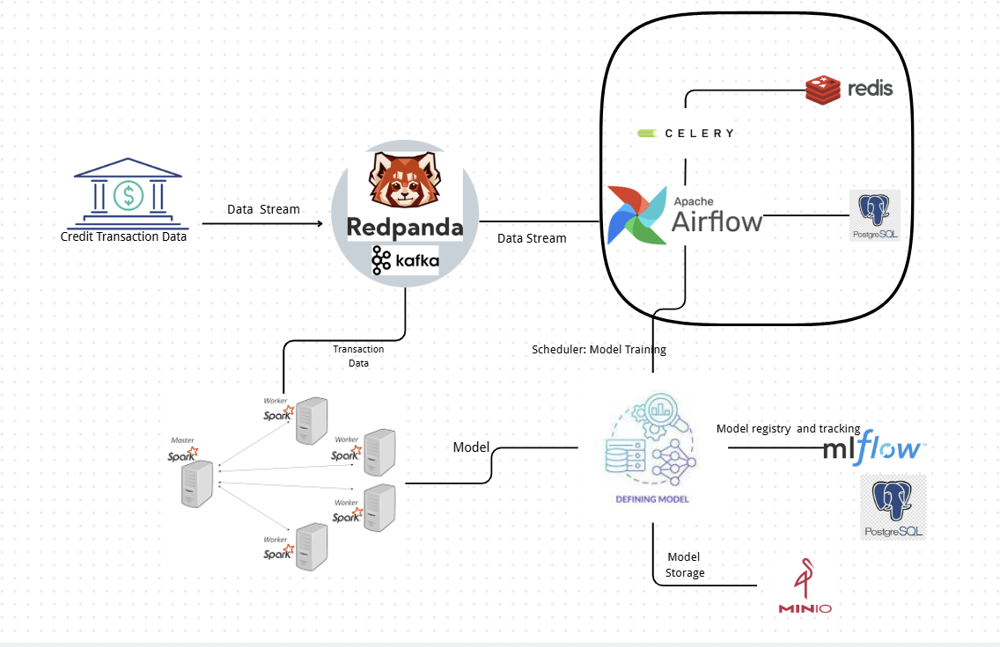

# Realtime Fraud Detection System

A production-ready, end-to-end machine learning system for real-time fraud detection in financial transactions. This project implements a scalable MLOps pipeline that ingests transaction data from Kafka/Redpanda, trains multiple ML models (XGBoost, CatBoost, LightGBM, Logistic Regression, etc.) with rigorous cross-validation and feature engineering, tracks experiments with MLflow, orchestrates workflows with Apache Airflow, and performs distributed real-time inference using Apache Spark Streaming.


## 📋 Table of Contents

- [Useful Links](#-useful-links)
- [Features](#-features)
- [Architecture](#-architecture)
- [Tech Stack](#-tech-stack)
- [Prerequisites](#-prerequisites)
- [Quick Start](#-quick-start)
- [Configuration](#-configuration)
- [Project Structure](#-project-structure)
- [Model Training](#-model-training)
- [Real-time Inference](#-real-time-inference)
- [Monitoring](#-monitoring)
- [Troubleshooting](#-troubleshooting)
- [License](#-license)


## 🔗 Useful Links

- **What is Redpanda:** https://github.com/redpanda-data/redpanda
- **What is Apache  Airflow**: https://github.com/apache/airflow
- **What is MinIO**: https://github.com/minio/minio
- **What is MLflow**: https://github.com/mlflow/mlflow
- **What is Apache Spark**: https://github.com/apache/spark

## ✨ Features

### Machine Learning Models
- **XGBoost**: Gradient boosting with regularization and early stopping
- **CatBoost**: Gradient boosting with native categorical feature support
- **LightGBM**: Fast gradient boosting with histogram-based learning
- **Logistic Regression**: Linear model with L1/L2 regularization
- **Decision Tree**: Single tree classifier
- **Extra Tree**: Extremely randomized trees
- **Random Forest**: Ensemble of decision trees
- **MLP (Multi-Layer Perceptron)**: Deep neural network classifier
- **TabNet**: Attention-based tabular learning

### Key Capabilities
- 🔄 **10-fold Stratified Cross-Validation**: Rigorous model evaluation with proper data splitting
- 🎯 **Feature Engineering**: Temporal, behavioral, and monetary feature construction
- 🔍 **Feature Selection**: Automatic feature importance-based selection to reduce overfitting
- 📊 **Model Tracking**: MLflow integration for experiment tracking and model versioning
- ⚡ **Real-time Inference**: Spark Streaming for low-latency fraud detection
- 🔧 **Hyperparameter Tuning**: Automated hyperparameter search with cross-validation
- 📈 **Performance Monitoring**: Comprehensive metrics (ROC-AUC, PR-AUC, Precision, Recall, F1)
- 🐳 **Dockerized**: Fully containerized with Docker Compose for easy deployment
- 🔐 **Production-Ready**: Includes data leakage prevention, regularization, and noise injection

## 🏗️ Architecture

### System Overview

The system consists of several interconnected components:

1. **Data Ingestion**: Transaction data flows through Kafka/Redpanda topics
2. **Model Training**: Airflow DAGs orchestrate training workflows with 10-fold cross-validation
3. **Experiment Tracking**: MLflow tracks all experiments, metrics, and model artifacts
4. **Model Storage**: MinIO (S3-compatible) stores trained models
5. **Real-time Inference**: Spark Streaming processes transactions and generates fraud predictions
6. **Workflow Orchestration**: Apache Airflow manages the entire MLOps pipeline

### Data Flow

```
Transaction Data → Kafka/Redpanda → Airflow Training Jobs → MLflow Tracking
                                              ↓
                                         Model Storage (MinIO)
                                              ↓
Transaction Stream → Spark Streaming → Model Inference → Fraud Predictions → Kafka
```

### Key Components



- **Apache Airflow**: Workflow orchestration and scheduling
- **MLflow**: Experiment tracking and model registry
- **Apache Spark**: Distributed stream processing for real-time inference
- **Kafka/Redpanda**: Message broker for data streaming
- **PostgreSQL**: Airflow metadata database
- **Redis**: Celery task queue broker
- **MinIO**: S3-compatible object storage for model artifacts

## 🛠️ Tech Stack

### Core Technologies
- **Python 3.10**: Primary programming language
- **Apache Airflow 2.10.5**: Workflow orchestration
- **MLflow**: Model tracking and versioning
- **Apache Spark 3.5.4**: Distributed processing
- **Kafka/Redpanda**: Stream processing platform

### Machine Learning Libraries
- **XGBoost**: Gradient boosting framework
- **CatBoost**: Gradient boosting with categorical support
- **LightGBM**: Fast gradient boosting
- **scikit-learn**: Traditional ML algorithms

### Infrastructure
- **Docker & Docker Compose**: Containerization
- **PostgreSQL**: Database
- **Redis**: Message broker
- **MinIO**: Object storage

## 📦 Prerequisites

Before you begin, ensure you have the following installed:

- **Docker** (version 20.10 or higher)
- **Docker Compose** (version 2.0 or higher)
- **Git**
- **At least 8GB RAM** (16GB recommended)
- **50GB free disk space**

### System Requirements

- **CPU**: 4+ cores recommended
- **Memory**: 8GB minimum, 16GB recommended
- **OS**: Linux, macOS, or Windows with WSL2

### Port Requirements

The following ports need to be available:
- `8080`: Airflow Webserver
- `5555`: Airflow Flower (Celery monitoring)
- `5500`: MLflow UI
- `9000`: MinIO Console
- `19092`: Kafka (external)
- `18081`: Schema Registry (external)
- `8000`: Inference Service

## 🚀 Quick Start

### 1. Clone the Repository

```bash
git clone <repository-url>
cd realtime_fraud_detection
```

### 2. Set Up Environment Variables

Create a `.env` file in the root directory:

```bash
cp .env.example .env  # If .env.example exists
# Or create .env manually
```

Edit `.env` with your configuration:

```env
AIRFLOW_UID=50000
AIRFLOW_PROJ_DIR=.
MLFLOW_TRACKING_URI=http://mlflow-server:5500
AWS_ACCESS_KEY_ID=minioadmin
AWS_SECRET_ACCESS_KEY=minioadmin
```

### 3. Build and Start Services

```bash
# Build custom Airflow image
docker-compose build

# Initialize Airflow database
docker-compose up airflow-init

# Start all services
docker-compose up -d

# View logs
docker-compose logs -f
```

### 4. Access the Services

- **Airflow UI**: http://localhost:8080
  - Default credentials: `airflow` / `airflow`
- **MLflow UI**: http://localhost:5500
- **MinIO Console**: http://localhost:9000
  - Default credentials: `minioadmin` / `minioadmin`
- **Airflow Flower**: http://localhost:5555

### 5. Trigger Model Training

1. Open Airflow UI at http://localhost:8080
2. Navigate to the DAGs page
3. Unpause the desired training DAG (e.g., `fraud_detection_xgboost_training`)
4. Click "Trigger DAG" to start training

## ⚙️ Configuration

### Main Configuration File (`config.yaml`)

The system uses a centralized YAML configuration file for all settings:

```yaml
mlflow:
  experiment_name: "fraud_detection"
  tracking_uri: "http://mlflow-server:5500"
  s3_endpoint_url: "http://minio:9000"

kafka:
  bootstrap_servers: "kafka_broker:9092"
  topic: "ml_model_train"
  output_topic: "fraud_predictions"

models:
  xgboost:
    n_folds: 10
    early_stopping_rounds: 25
    use_feature_selection: true
    max_features: 10
    params:
      n_estimators: 50
      max_depth: 2
      learning_rate: 0.03
      # ... more parameters
```

### Model-Specific Configuration

Each model has its own configuration section with:
- **Cross-validation**: `n_folds` (default: 10)
- **Feature Selection**: `use_feature_selection`, `max_features`, `feature_selection_threshold`
- **Early Stopping**: `early_stopping_rounds`
- **Hyperparameters**: Model-specific parameters under `params`
- **Paths**: Model storage paths

### Environment Variables

Key environment variables:
- `AIRFLOW_UID`: Airflow user ID
- `MLFLOW_TRACKING_URI`: MLflow server URL
- `AWS_ACCESS_KEY_ID`: MinIO access key
- `AWS_SECRET_ACCESS_KEY`: MinIO secret key

## 📁 Project Structure

```
realtime_fraud_detection/
├── airflow/                    # Airflow configuration
│   ├── Dockerfile             # Custom Airflow image
│   ├── entrypoint.sh          # Entrypoint script
│   └── requirements.txt       # Python dependencies
├── dags/                      # Airflow DAGs
│   ├── *_model_train.py       # Training scripts
│   └── *_model_train_dag.py   # DAG definitions
├── inference/                 # Real-time inference service
│   ├── Dockerfile
│   ├── main.py               # Spark Streaming inference
│   └── requirements.txt
├── producer/                  # Data producer service
│   ├── Dockerfile
│   ├── main.py               # Kafka producer
│   └── requirements.txt
├── mlflow/                    # MLflow server
│   ├── Dockerfile
│   └── requirements.txt
├── config.yaml                # Main configuration file
├── docker-compose.yml         # Docker Compose configuration
├── data/                      # Training data
└── models/                    # Trained model artifacts
```

## 🎓 Model Training

### Supported Models

The system supports training multiple ML models:

- **Logistic Regression**: `fraud_detection_logistic_training`
- **XGBoost**: `fraud_detection_xgboost_training`
- **CatBoost**: `fraud_detection_catboost_training`
- **LightGBM**: `fraud_detection_lightgbm_training`
- **Decision Tree**: `fraud_detection_decision_tree_training`
- **Extra Tree**: `fraud_detection_extra_tree_training`
- **Random Forest**: `fraud_detection_random_forest_training`
- **MLP**: `fraud_detection_mlp_training`
- **TabNet**: `fraud_detection_tabnet_training`

### Training Process

1. **Data Ingestion**: Data is read from Kafka or CSV fallback
2. **Feature Engineering**: Temporal, behavioral, and monetary features are created
3. **Data Preprocessing**: Missing value imputation, scaling, encoding
4. **Feature Selection**: Automatic feature importance-based selection
5. **Cross-Validation**: 10-fold stratified cross-validation
6. **Model Training**: Training with early stopping and regularization
7. **Evaluation**: Comprehensive metrics calculation
8. **Model Persistence**: Models saved to disk and MLflow

### Training Metrics

Each model training tracks:
- **ROC-AUC**: Area under ROC curve
- **PR-AUC**: Average precision (area under precision-recall curve)
- **Precision**: Positive predictive value
- **Recall**: True positive rate
- **F1-Score**: Harmonic mean of precision and recall
- **Decision Threshold**: Optimal threshold based on recall target

### Viewing Training Results

1. **Airflow**: Check DAG run logs for training progress
2. **MLflow**: Visit http://localhost:5500 to view experiments, metrics, and models
3. **Model Files**: Trained models are saved in `./models/` directory

## 🔮 Real-time Inference

### Starting the Inference Service

```bash
# Start the inference service
docker-compose up -d inference-service

# View logs
docker-compose logs -f inference-service
```

### Inference Pipeline

1. **Data Consumption**: Spark Streaming reads from Kafka topic
2. **Feature Engineering**: Same features as training pipeline
3. **Model Inference**: Loaded model predicts fraud probability
4. **Threshold Application**: Predictions based on configured threshold
5. **Result Publishing**: Predictions written back to Kafka output topic

### Data Format

Input transactions should include:
- `amount`: Transaction amount
- `zip`, `lat`, `long`: Location information
- `city_pop`: City population
- `merchant_lat`, `merchant_long`: Merchant location
- `transaction_time`: Timestamp
- `category`, `state`, `gender`, `city`, `merchant`: Categorical features

### Output Format

Predictions include:
- `prediction`: Binary fraud prediction (0 or 1)
- `fraud_probability`: Fraud probability score (0 to 1)

## 📊 Monitoring

### MLflow Experiment Tracking

Access MLflow UI at http://localhost:5500 to:
- View all training runs
- Compare model performance
- Download model artifacts
- Register production models

### Airflow Monitoring

- **DAG Runs**: Monitor training job status
- **Task Logs**: View detailed execution logs
- **Flower**: Monitor Celery workers at http://localhost:5555

### Model Performance

Key metrics tracked:
- Cross-validation mean and std of all metrics
- Test set performance
- Feature importance
- Training time and resources

## 🔧 Troubleshooting

### Common Issues

#### 1. Port Already in Use

```bash
# Check what's using the port
lsof -i :8080

# Stop conflicting services or change ports in docker-compose.yml
```

#### 2. Docker Build Fails

```bash
# Clean Docker cache
docker system prune -a

# Rebuild without cache
docker-compose build --no-cache
```

#### 3. Airflow Init Fails

```bash
# Remove existing volumes
docker-compose down -v

# Reinitialize
docker-compose up airflow-init
```

#### 4. Model Training Fails

- Check Airflow logs: `docker-compose logs airflow-worker`
- Verify data availability in Kafka
- Check MLflow connection: `docker-compose logs mlflow-server`
- Verify MinIO is running: `docker-compose ps minio`

#### 5. LightGBM libgomp Error

If you see `libgomp.so.1: cannot open shared object file`:
- Ensure the Airflow Dockerfile includes `libgomp1` installation
- Rebuild the Airflow image: `docker-compose build airflow`

### Debugging Tips

1. **Check Service Status**: `docker-compose ps`
2. **View Logs**: `docker-compose logs -f <service-name>`
3. **Execute Commands**: `docker-compose exec <service-name> bash`
4. **Check Network**: `docker network inspect realtime-fraud-detection_default`


## 📄 License

This project is licensed under the MIT License - see the [LICENSE](LICENSE) file for details.

## 🙏 Acknowledgments

- Apache Airflow for workflow orchestration
- MLflow for experiment tracking
- Apache Spark for distributed processing
- All the open-source ML libraries used in this project
